# 🌱 EcoTwin.ai

**EcoTwin.ai** is an AI-powered sustainability platform that transforms carbon tracking into an engaging and emotional experience through a living digital companion.

Built for **PromptWars 2026**, EcoTwin replaces dry carbon calculators with a dynamic EcoTwin that evolves based on user lifestyle choices.

---

## 🚀 Inspiration

Traditional carbon footprint trackers are often boring, data-heavy, and difficult to maintain.

EcoTwin was created to answer a simple question:

> **What if your carbon footprint had a voice, emotions, and a living form?**

Instead of spreadsheets and statistics, users interact with a growing digital ecosystem that reacts to their everyday choices.

---

## ✨ Features

### 🌿 Living EcoTwin Avatar

* Dynamic digital companion that evolves according to sustainability score.
* Growth stages: Seed → Sprout → Sapling → Tree.

### 📊 Personalized Sustainability Score

* Users answer simple onboarding questions.
* Eco score is generated instantly.
* Visual progress bar and achievement badges.

### 💬 Sentient Diary

* AI-generated diary entries written from the EcoTwin's perspective.
* Makes sustainability emotionally engaging.

### 🔮 Future Simulator

* Predicts future EcoTwin growth based on improved habits.
* Encourages long-term behavior change.

### 🌎 Daily Eco Tips

* Personalized sustainability recommendations.
* Actionable suggestions for reducing carbon footprint.

### 🏆 Gamification

* Eco badges.
* Streak system.
* Achievement-driven experience.

---

## 🛠 Tech Stack

### Frontend

* Next.js 16
* React
* TypeScript
* Tailwind CSS

### Backend & Storage

* Firebase Authentication
* Firebase Firestore

### AI & Google Ecosystem

* Gemini API (planned)
* Google Maps API (planned)

### Deployment

* Vercel

---

## 📷 Application Flow

1. User signs in.
2. Completes onboarding questionnaire.
3. Eco score is calculated.
4. EcoTwin avatar evolves.
5. Dashboard displays:

   * Sustainability score
   * Eco badges
   * Daily tips
   * Sentient diary
   * Future simulator

---

## 🎯 Problem Solved

EcoTwin tackles:

* Low engagement in sustainability apps.
* Manual carbon logging fatigue.
* Lack of emotional connection with climate impact.

---

## 🔮 Future Scope

* Pantry image scanner using Gemini Vision.
* Google Maps carbon routing.
* AI-generated daily journals.
* Real-time emissions tracking.
* Community challenges and leaderboards.

---

## Security

- Authentication handled through Google OAuth (prototype mode uses local storage simulation).
- Production deployment would use Firebase Authentication and Firestore security rules.
- No sensitive personal data is stored.

---

## 👨‍💻 Developed By

**Arya Jadhav**

Built for **PromptWars 2026**.

---

## 📜 License

MIT License
# 🌍 EcoTwin AI

> **Your Carbon Footprint Has a Voice.**

EcoTwin AI is a next-generation sustainability platform that transforms traditional carbon tracking into an emotional, interactive experience through an AI-powered digital twin.

Instead of filling endless spreadsheets and manually calculating emissions, users simply answer a few questions and watch their EcoTwin evolve based on their lifestyle choices.

Built for **PromptWars Challenge 3**.

---

## 🚀 Live Demo

🔗 **Deployed Application:** https://ecotwin-ai-two.vercel.app/

🔗 **GitHub Repository:** https://github.com/ajrocks-afk/ecotwin-ai

---

## 🎯 Problem Statement

Current sustainability applications often suffer from:

* Low user engagement.
* Complex manual carbon calculations.
* Dry and non-personal experiences.
* Lack of emotional connection with climate impact.

As a result, users abandon sustainability tracking after only a few days.

---

## 💡 Our Solution

EcoTwin AI introduces a living digital companion that visually reflects the environmental impact of a user's lifestyle.

The EcoTwin:

* Grows healthier as users adopt sustainable habits.
* Generates emotional first-person diary entries using AI.
* Simulates future sustainability outcomes.
* Encourages long-term behavioural change through empathy and gamification.

---

## ✨ Key Features

### 🌱 Interactive EcoTwin Avatar

A dynamic digital twin that visually evolves according to sustainability scores.

### 📖 Sentient Diary (Powered by Gemini)

Generates personalized first-person journal entries from the EcoTwin's perspective.

### 📊 Sustainability Dashboard

Displays:

* Eco score
* Planet health
* Achievements
* Streaks
* Sustainability insights

### 🔮 Future Simulator

Users can simulate greener habits and instantly visualize projected sustainability improvements.

### 🏆 Achievement System

Gamified badges encourage users to maintain sustainable behaviour.

### 🌍 Earth Health Meter

Provides a visual representation of the user's environmental contribution.

---

## 🏗️ System Architecture

```text
User
  ↓
Next.js Frontend
  ↓
Dashboard / State Management
  ↓
Gemini API + Business Logic
  ↓
Firebase Storage & Authentication
```

---

## 🧠 AI Integration

Google Gemini powers:

* AI-generated EcoTwin diary entries.
* Personalized sustainability narratives.
* Dynamic emotional responses based on carbon scores.

Example prompt:

```text
Write a first-person diary entry from the perspective of an environmental digital twin based on the user's sustainability score.
```

---

## 🛠️ Tech Stack

### Frontend

* Next.js 16
* React 19
* Tailwind CSS

### Backend

* Next.js API Routes

### AI

* Google Gemini 1.5 Flash

### Database & Authentication

* Firebase

### Deployment

* Vercel

### Testing

* Jest
* Testing Library

---

## 🔐 Security Features

* Input sanitization.
* API validation.
* Rate limiting.
* Error handling.
* Secure environment variables.

---

## 🧪 Testing

Implemented unit tests for:

* Streak calculations.
* Future score projections.
* Dashboard logic.

Run tests locally:

```bash
npm test
```

---

## 📸 Screenshots

## 📸 Screenshots

### Landing Page

<p align="center">
  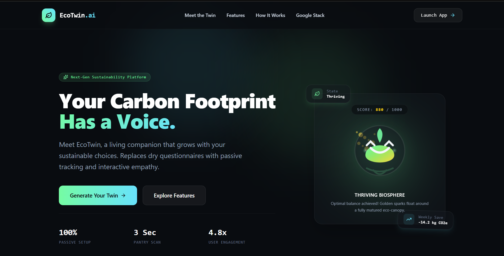
  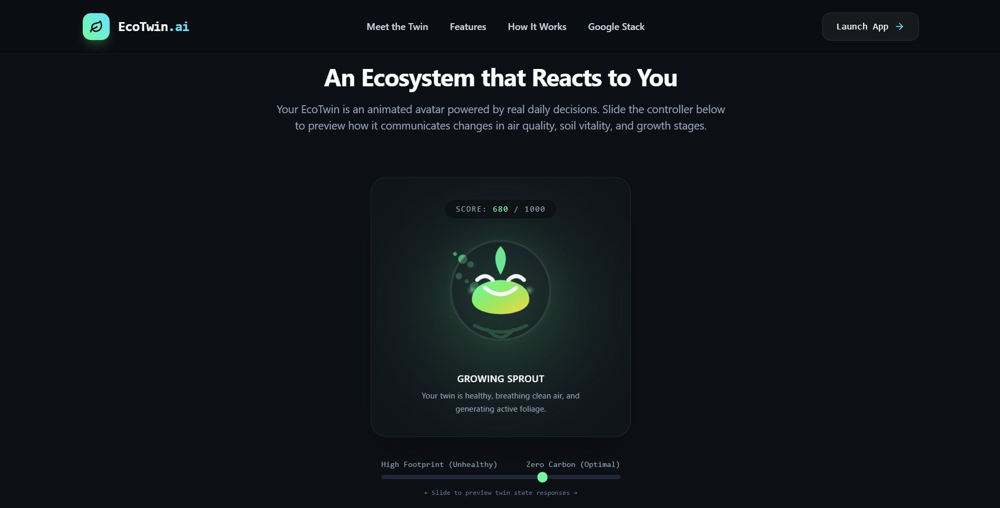
  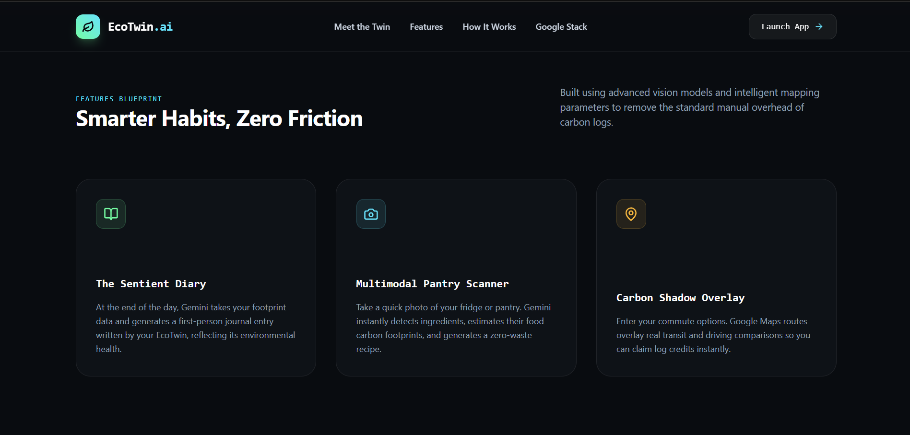
  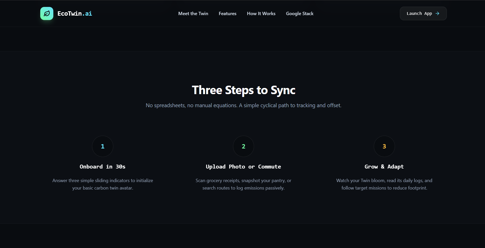
  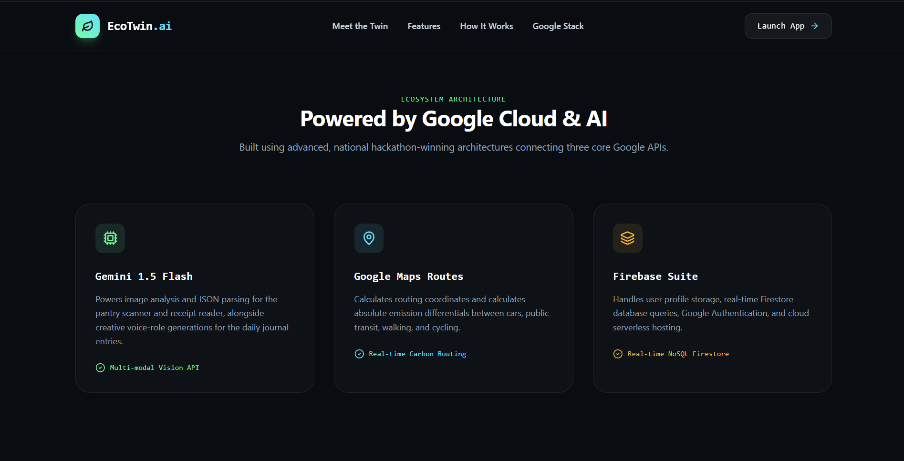
  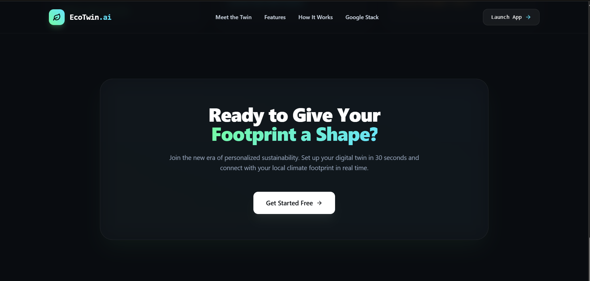
</p>

### Dashboard

<p align="center">
  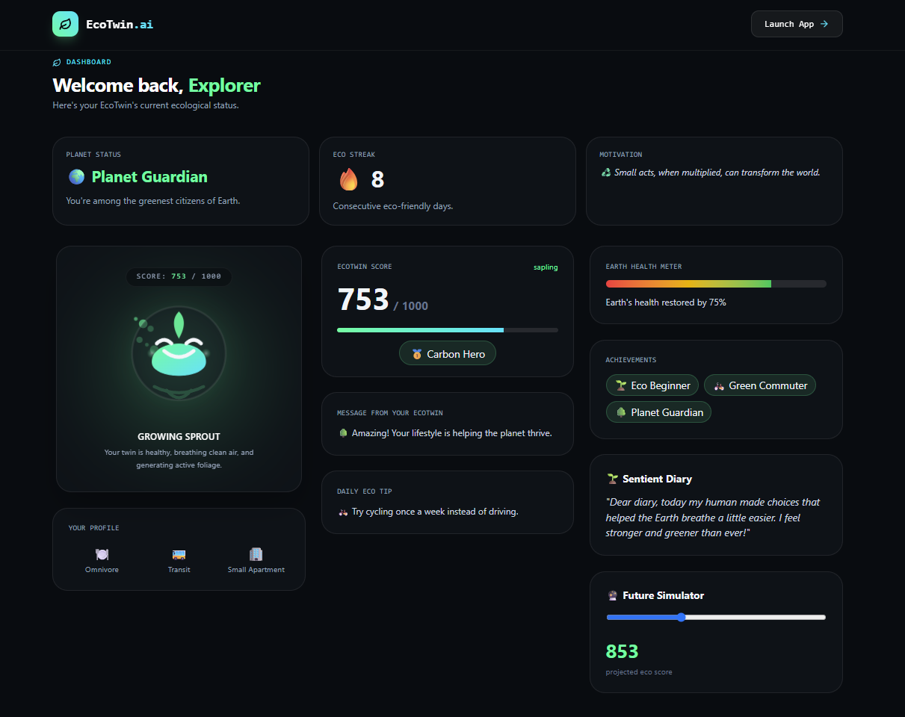
</p>

### Onboarding

<p align="center">
  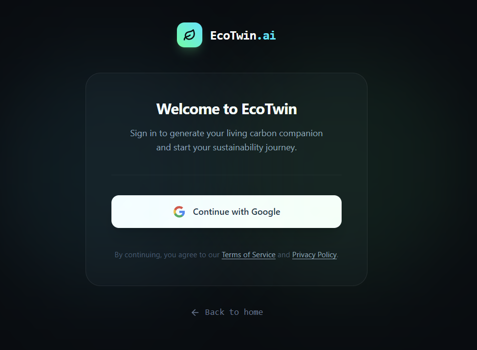
  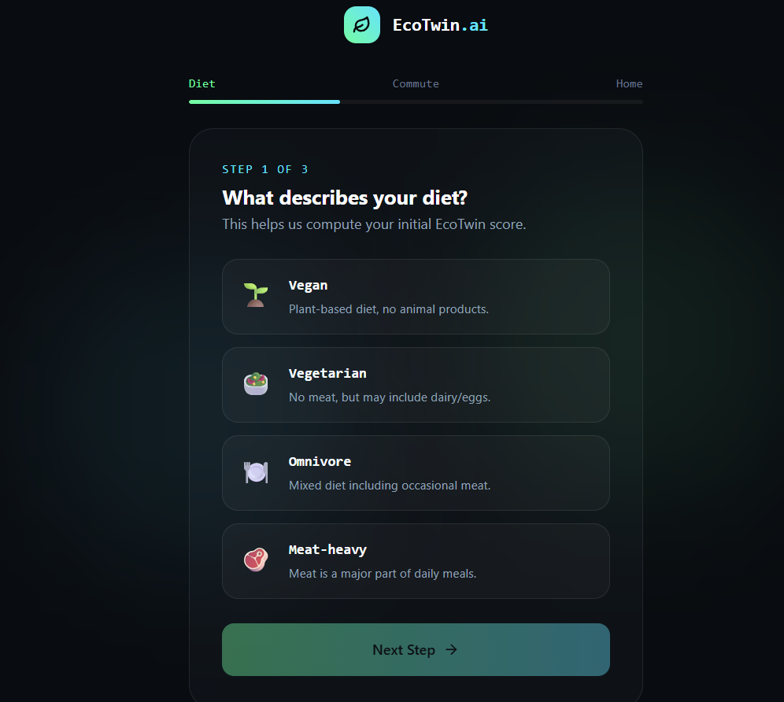
  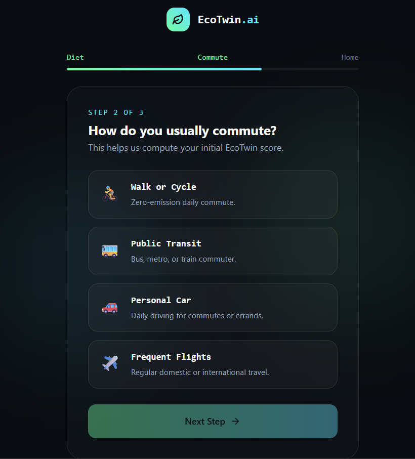
  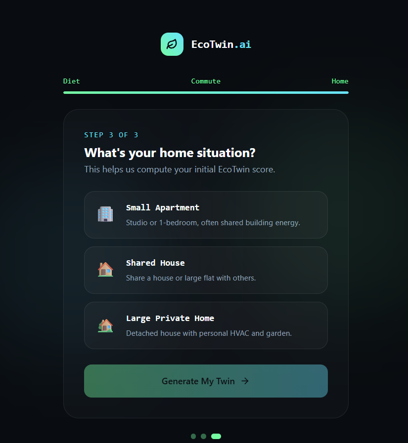
</p>

### EcoTwin Avatar

<p align="center">
  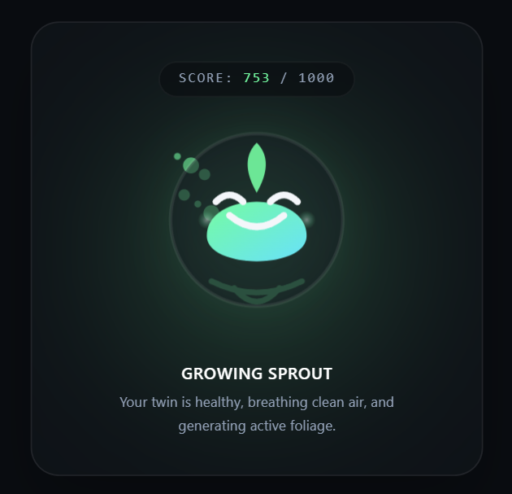
  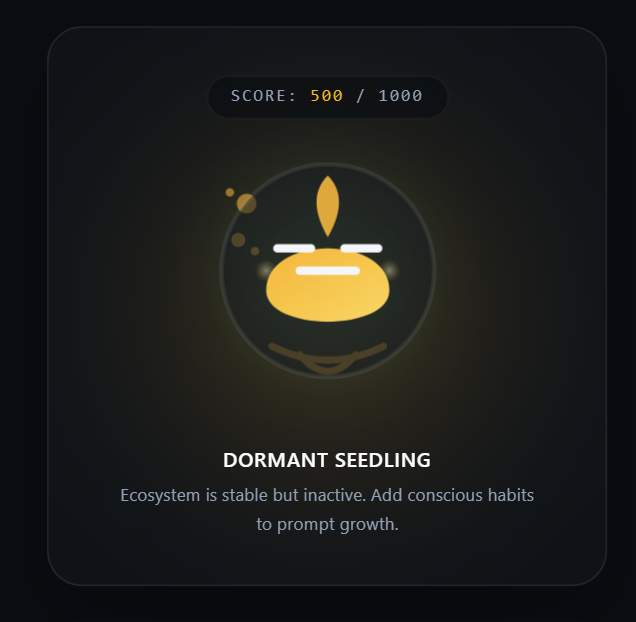
  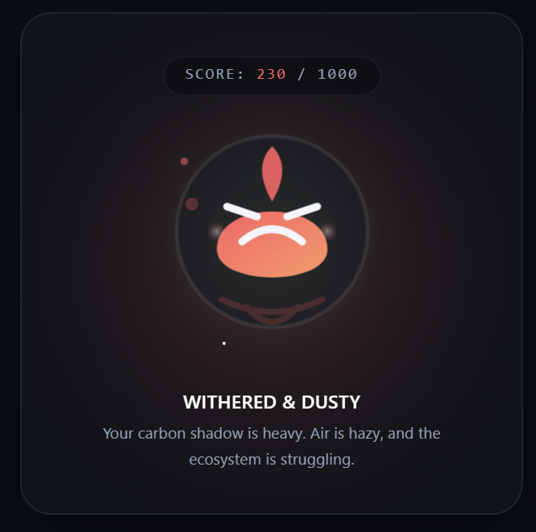
</p>

---

## ⚙️ Local Setup

Clone the repository:

```bash
git clone https://github.com/ajrocks-afk/ecotwin-ai.git
```

Install dependencies:

```bash
npm install
```

Create `.env.local`:

```env
GEMINI_API_KEY=your_gemini_api_key_here
```

Run locally:

```bash
npm run dev
```

---

## 🌟 Future Enhancements

* Multimodal pantry scanner.
* Carbon-aware route optimization.
* Real-world sustainability recommendations.
* Community challenges and leaderboards.
* Wearable device integration.

---

## 🏆 Built For

**PromptWars Challenge 3**

Theme: AI-powered sustainability experiences.

---

## 👨‍💻 Author

**Arya Jadhav**

LinkedIn: YOUR_LINKEDIN_URL

GitHub: https://github.com/ajrocks-afk

---

## 📄 License

MIT License
